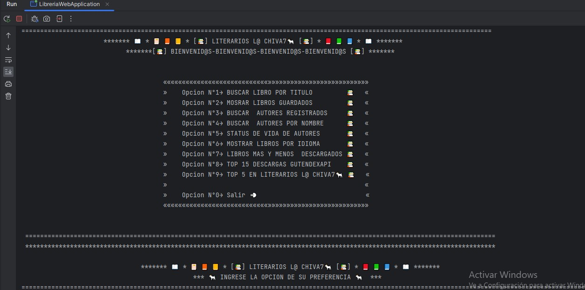
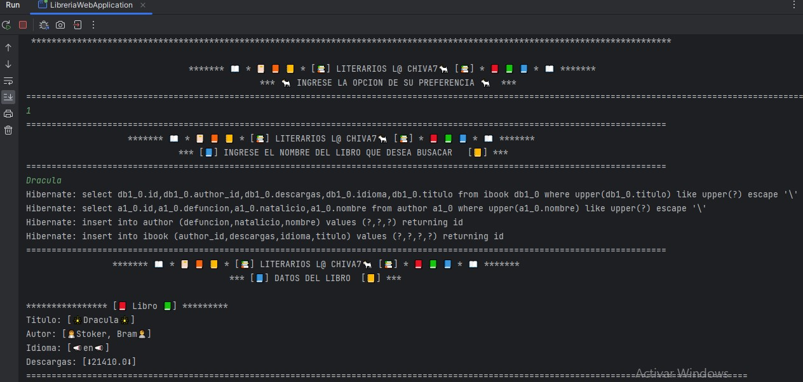
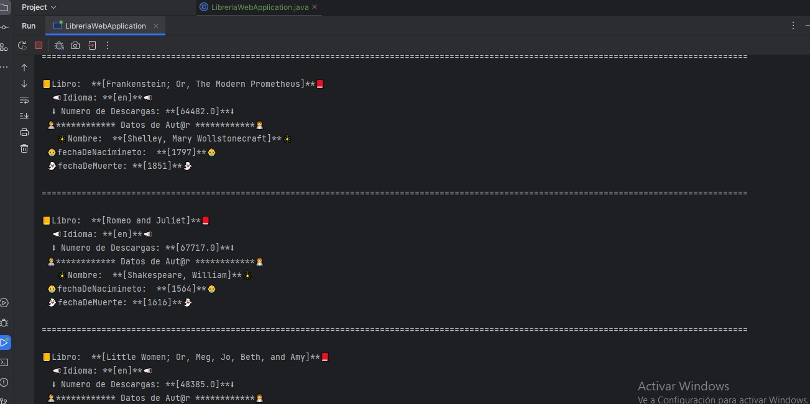
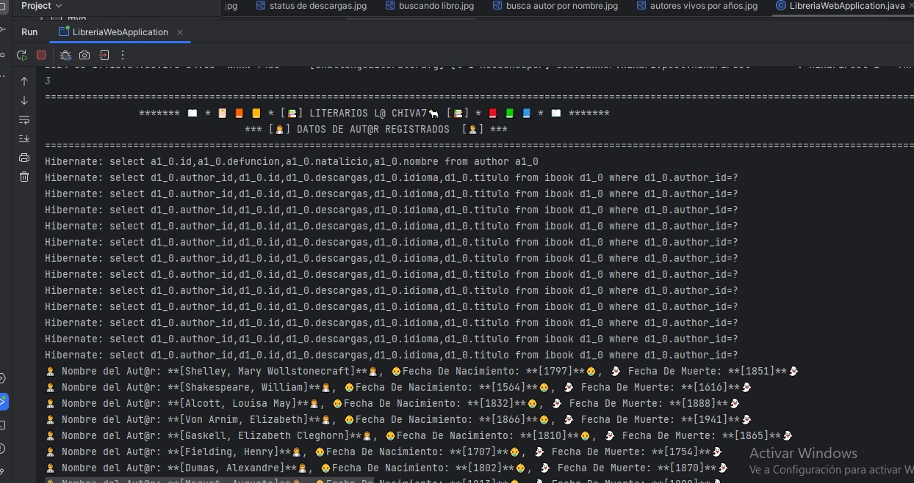
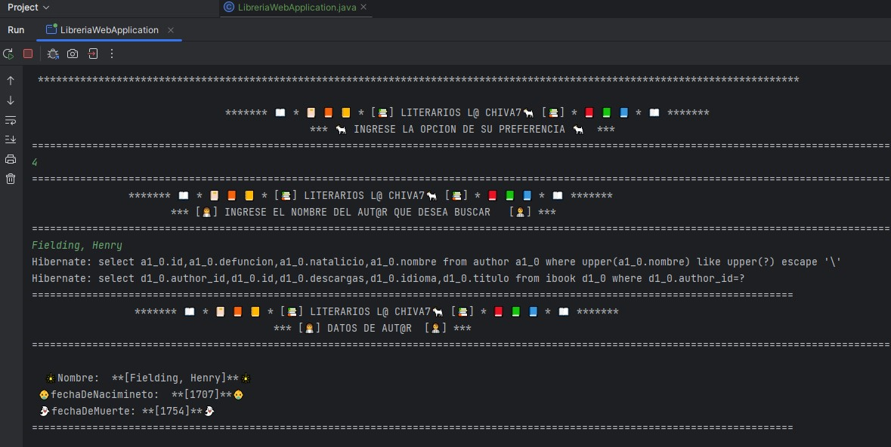
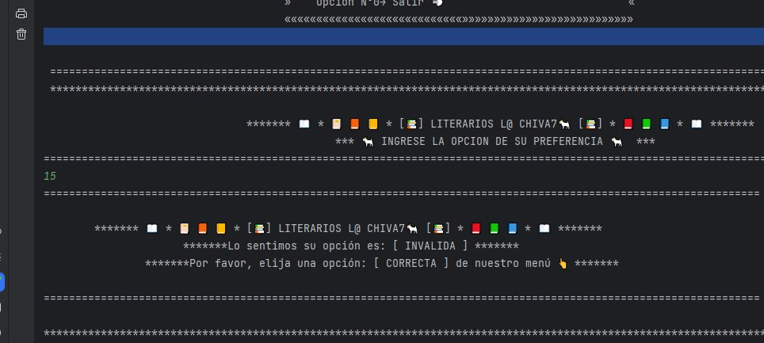
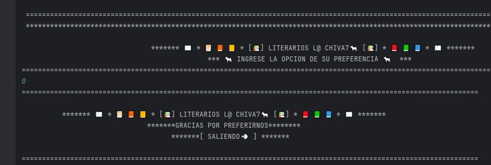

## 
# **📚Challenge-LiterAlura📚**
# ***📘LITERARIOS L@CHIVA🐐7📗*** 
  

1- Realizacion de un programa que permite compilar libros de la API Gutendex y almacenarlos en una base de datos, donde se pueden observar los datos relacionados con cada libro que este presente alli y sus respectivos autores realmente esta buena, cuenta con las siguientes caracteristicas:

- Presenta un menu que permite al usuario una comunicacion amigable 📑

- Se podria descarga el libro que este en la Api gutendex y almacenrlo con sus datos 📘

- Se puede saver si un autor estaba vivo en un determnado año y cual es su data de vida 👶➖👻

- Solicita a la API Gutendes la misma envia datos actualizados de sus Titulos 📚

- Podemos ver la cantidad de descargas maximas y minimas, en la Api y el Tpo que tenemos en la base de datos segun el numero de descargas ⬇

2- El editor usado para este proyecto es el IDE 

3- El archivo READMI, se crea usando 

4- Cuenta con repositorio local  y remoto 

5- Apoyado de un repositorio de  "https://ileriayo.github.io/markdown-badges" para gestionar estos badges estaticos.

6- Con colaboracionde grupo de estudio en , 

7-Se deja una pequeña presentacion de lo que puede hacer este simpatico proyecto
### ***
 📔Menu Principal📕
***

### ***
 📘Buscando Libros en Gutendex API📓
***
 
### ***
 📚Libros Guardados en Base de Datos L@Civa7🐐📒
***
 
### ***
 👩‍💼Autores Registrados en Base de Datos L@Civa7🐐👨‍💼
***
 
### ***
 👨‍💼Autores Por Nombre👩‍💼
***
 
### ***
 Opcion Defoult 
***

### ***
 💨 Finalizacion o salida 
***
 